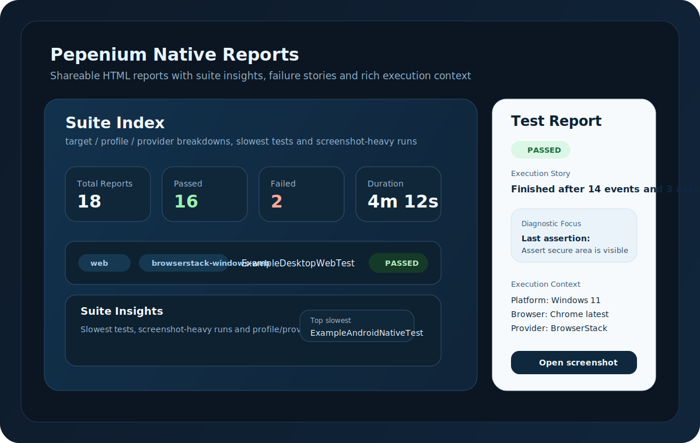

<p align="center">
  <a href="https://github.com/roberto22palomar/pepenium/actions/workflows/ci-build.yml">
    
  </a>
</p>

<p align="center">
  <a href="LICENSE">
    
  </a>
  
  
  
  
  
</p>

# Pepenium

<p align="center">
  <strong>English</strong> |
  <a href="README.es.md">Espanol</a>
</p>

Pepenium is a Java automation framework for Android, iOS and Web built on top of Appium, Selenium and JUnit 5.

Its current direction is simple to understand and practical to run: tests declare a functional target, execution profiles decide where they run, and the framework owns session lifecycle, logging and failure diagnostics.

## Start Here

If you are new to the project, start with [START-HERE.md](docs/START-HERE.md).

Recommended first steps:

1. Run `mvn -q -DskipTests test-compile`
2. Run the desktop web showcase for your first live success
3. Move to Android only after the web path is working

Ready-to-copy environment examples:

- [`.env.web.example`](.env.web.example)
- [`.env.android.host-emulator.example`](.env.android.host-emulator.example)
- [`.env.android.docker-emulator.example`](.env.android.docker-emulator.example)

## Why Pepenium

- One test per functional target, not one test per provider
- Shared execution model for local, BrowserStack and AWS Device Farm
- Centralized driver/session lifecycle through a single session factory
- Reusable `Actions*` helpers for Web, Android and iOS
- Screenshot helpers designed for fast flows without blurred captures
- Cleaner logs with automatic runtime context and failure evidence

See [START-HERE.md](docs/START-HERE.md) for the fastest first-run path, [QUICK-START.md](docs/QUICK-START.md) for the fuller walkthrough and [CHANGELOG.md](CHANGELOG.md) for release history.
Use [ENVIRONMENT.md](docs/ENVIRONMENT.md) as the central reference for environment variables and runtime properties.
Use [API.md](docs/API.md) for the current public-vs-internal API guidance on the road to `1.0.0`.
Use the root `docker-compose.yaml` if you want to run the local Appium server in Docker while keeping the Android emulator on the host.
Use [consumer-smoke/README.md](consumer-smoke/README.md) for the standalone public-API consumer smoke validation flow.

The main CI workflow now runs framework `verify` and then validates that standalone consumer smoke, so quality gates and public API consumption are both checked continuously.

## Using Pepenium From Another Project

If you want to consume Pepenium from a separate Maven project, the short rule is:

- use `pepenium-toolkit` for normal test-authoring projects
- use `pepenium` only if you intentionally want the lower-level runtime/core layer without the toolkit helpers
- do **not** add `pepenium-parent` under `<dependencies>` because it is the Maven parent POM, not the normal runtime dependency for test code

Typical consumer dependency:

```xml
<dependency>
    <groupId>io.github.roberto22palomar</groupId>
    <artifactId>pepenium-toolkit</artifactId>
    <version>0.9.3</version>
</dependency>
```

Why `pepenium-toolkit` is usually the right entry point:

- it is the artifact most external users actually want to build against
- it gives you `ActionsWeb`, `ActionsApp`, `ActionsAppIOS`, `AssertionsWeb`, `AssertionsApp` and `AssertionsAppIOS`
- it pulls in the core runtime transitively, so you still get `BaseTest` and `TestTarget` without wiring both layers manually

If you want a concrete consumer example, see [consumer-smoke/README.md](consumer-smoke/README.md).

## Plug-and-Play Authoring

Pepenium now recommends an annotation-first authoring style for teams that want the framework to feel as plug-and-play as possible.

Typical shape:

```java
@PepeniumTest(target = TestTarget.WEB_DESKTOP)
class LoginTest {

    @PepeniumInject
    private WebDriver driver;

    @PepeniumInject
    private LoginFlow flow;

    @Test
    void loginWorks() {
        driver.get("https://the-internet.herokuapp.com/login");
        flow.runSuccessfulLogin("tomsmith", "SuperSecretPassword!");
    }
}
```

That recommended style supports:

- `@PepeniumTest` instead of extending `BaseTest`
- `@PepeniumInject` for `WebDriver`, `DriverSession`, `Actions*`, `Assertions*`, pages and flows
- `@PepeniumPage` plus Selenium `@FindBy` fields for lighter page objects
- `PepeniumSteps` injection for simple step recording without inheriting helper methods

`BaseTest` remains fully supported as the classic authoring path. The annotation-first path is now the recommended shape as Pepenium approaches `1.0.0`.

## Native Reports

Pepenium now generates a native HTML and JSON reporting bundle out of the box after test execution.



What it generates:

- a suite-level `index.html`
- a suite-level `summary.json`
- one per-test HTML report
- one per-test JSON report
- linked screenshots for evidence when they are available

The HTML reports are treated as supported user-facing diagnostics. The JSON files are available and useful, but their schema is still evolving and is not yet promised as a versioned public contract.

Where it writes by default:

```text
target/pepenium-reports/
```

Why it is useful:

- you can open a clean HTML report instead of reading raw console logs
- failures surface execution story, diagnostic focus, assertion badges and grouped screenshots
- the suite index gives you pass/fail summary cards, target/profile/provider breakdowns and quick insights such as slowest tests
- console output prints direct `file:///...` links to the individual report and the suite index

Use [REPORTING.md](docs/REPORTING.md) for the reporting-specific details and configuration knobs.

## What The Current 0.9.x Line Adds

- Real Maven quality gates through Enforcer, JaCoCo, Checkstyle and SpotBugs
- A stronger `verify` path in CI so library hygiene is checked continuously
- Release-oriented metadata and packaging for sources and Javadocs
- Dedicated release preflight and tagged publication workflows
- Public API compatibility checks and stronger consumer-smoke validation
- Hardening passes in `core`, `toolkit`, execution profiles and reporting

## Current Architecture

Repository modules:

- `pepenium-core`: framework engine, runtime, execution and provider configuration
- `pepenium-toolkit`: reusable test-author helpers such as actions and support utilities
- `pepenium-examples`: repository-only example tests, flows and page objects built on top of `pepenium` and `pepenium-toolkit`

### `core`

Framework runtime and execution pieces:

- `PepeniumTest`
- `PepeniumInject`
- `PepeniumPage`
- `PepeniumSteps`
- `BaseTest`
- `DriverConfig`
- `DriverRequest`
- `DriverSession`
- `DriverSessionFactory`
- `DefaultDriverSessionFactory`
- `ExecutionProfile`
- `ExecutionProfiles`
- `ExecutionProfileResolver`
- `FailureContextReporter`
- `LoggingContext`
- `PepeniumBanner`
- `StepTracker`
- `TestTarget`
- `core/config/browserstack`: BrowserStack config models
- `core/config/yaml`: YAML loaders for BrowserStack catalogs

Provider-specific request builders currently live under:

- `core/configs/local`
- `core/configs/browserstack`
- `core/configs/aws`

### `toolkit`

Reusable building blocks:

- `toolkit/actions`: `ActionsWeb`, `ActionsApp`, `ActionsAppIOS`
- `toolkit/assertions`: `AssertionsWeb`, `AssertionsApp`, `AssertionsAppIOS`
- `toolkit/support`: reusable settle and scroll helpers

### `examples`

Example tests showing the intended usage pattern:

- `pepenium-examples/src/test/java/.../tests/myProjectExample/android`
- `pepenium-examples/src/test/java/.../tests/myProjectExample/ios`
- `pepenium-examples/src/test/java/.../tests/myProjectExample/web`

Examples are grouped by functional target instead of by environment.
This module is intentionally repository-only: it is not a published consumer artifact and it is not part of the public API compatibility contract.

## Execution Model

Recommended tests declare a `TestTarget` through `@PepeniumTest`:

```java
@PepeniumTest(target = TestTarget.ANDROID_NATIVE)
public class ExampleAndroidNativeTest {

    @PepeniumInject
    private ExampleAndroidShowcaseFlow flow;
}
```

The classic `BaseTest` shape is still supported when a team prefers inheritance-based authoring.

At runtime, Pepenium resolves an execution profile:

- from `-Dpepenium.profile=...`
- or from `PEPENIUM_PROFILE`
- or from the target default profile when one exists
- with built-in profile metadata loaded from `pepenium-core/src/main/resources/execution-profiles.yml`

This keeps the same test portable across environments without changing its code.

## Supported Targets

- `ANDROID_NATIVE`
- `ANDROID_WEB`
- `IOS_NATIVE`
- `IOS_WEB`
- `WEB_DESKTOP`

## Built-In Execution Profiles

- `local-android`
- `local-android-web`
- `local-web`
- `local-web-firefox`
- `local-web-edge`
- `aws-android`
- `aws-android-web`
- `aws-ios`
- `browserstack-android`
- `browserstack-android-web`
- `browserstack-ios`
- `browserstack-ios-web`
- `browserstack-windows-web`
- `browserstack-mac-web`

The built-in profile catalog is defined in:

- `pepenium-core/src/main/resources/execution-profiles.yml`

Profile ids are part of the supported launch contract. The internal `configKey` values behind that catalog are framework wiring details and may still evolve before `1.0.0`.

## Example Tests

- Android native: [ExampleAndroidNativeTest.java](pepenium-examples/src/test/java/io/github/roberto22palomar/pepenium/tests/myProjectExample/android/ExampleAndroidNativeTest.java)
- Android web: [ExampleAndroidWebTest.java](pepenium-examples/src/test/java/io/github/roberto22palomar/pepenium/tests/myProjectExample/android/ExampleAndroidWebTest.java)
- iOS native: [ExampleIOSNativeTest.java](pepenium-examples/src/test/java/io/github/roberto22palomar/pepenium/tests/myProjectExample/ios/ExampleIOSNativeTest.java)
- iOS web: [ExampleIOSWebTest.java](pepenium-examples/src/test/java/io/github/roberto22palomar/pepenium/tests/myProjectExample/ios/ExampleIOSWebTest.java)
- Desktop web: [ExampleDesktopWebTest.java](pepenium-examples/src/test/java/io/github/roberto22palomar/pepenium/tests/myProjectExample/web/ExampleDesktopWebTest.java)

### Web Showcase Example

The web examples are now functional live examples against [The Internet](https://the-internet.herokuapp.com/), not only structural templates.

The `pepenium-examples` module is meant for runnable showcase code inside this repository. Its tests stay opt-in and skipped by default in normal reactor builds.

The desktop/mobile-web showcase currently demonstrates:

- profile-driven execution with the same test class
- reusable `ActionsWeb` and `AssertionsWeb`
- step-oriented tracing with `StepTracker`
- screenshots as evidence points
- page objects plus flow orchestration
- a real multi-page public flow:
  - login
  - secure area validation
  - dropdown interaction
  - checkbox state validation
  - add/remove elements example navigation

Default live example values:

- `PEPENIUM_BASE_URL=https://the-internet.herokuapp.com/login`
- `PEPENIUM_WEB_USERNAME=tomsmith`
- `PEPENIUM_WEB_PASSWORD=SuperSecretPassword!`

Run the desktop web showcase directly with:

```text
mvn -pl pepenium-examples -am "-Dpepenium.examples.skip.tests=false" "-Dpepenium.excludedTags=" "-Dtest=ExampleDesktopWebTest" "-Dsurefire.failIfNoSpecifiedTests=false" test
```

### Android Native Showcase Template

The Android native example is currently positioned as a stronger showcase template rather than a live public-app example.

That Android showcase now emphasizes:

- semantic flow steps through `StepTracker`
- reusable `ActionsApp` and `AssertionsApp`
- explicit page-load boundaries
- screenshots as evidence points
- a short but representative bottom-navigation plus search flow that can be adapted to a real product app

This keeps the Android example honest and useful while avoiding dependence on a third-party public app that may not be stable enough for an official framework showcase.

### iOS Native Showcase Template

The iOS native example follows the same strategy as Android native: it is a stronger showcase template rather than a live public-app example.

That iOS showcase emphasizes:

- semantic flow steps through `StepTracker`
- reusable `ActionsAppIOS` and `AssertionsAppIOS`
- explicit page-load boundaries
- screenshots as evidence points
- a short but representative bottom-navigation plus search flow that can be adapted to a real product app

This keeps the iOS example aligned with the Android example and gives the repository a more coherent native-mobile story.

## Running From the IDE

The intended workflow is:

1. Keep one test per target.
2. Create one IDE run configuration per execution profile you care about.
3. Point those run configurations to the same test class.

Example for the same Android native test:

- `Android Native - Local`
- `Android Native - BrowserStack`
- `Android Native - AWS`

Each run configuration changes only `pepenium.profile`.

That gives you one-click execution without editing the test.

## Local Execution

### Android Native

Default profile for `ANDROID_NATIVE`: `local-android`

Useful environment variables:

```text
APPIUM_URL=http://localhost:4723
ANDROID_UDID=emulator-5554
ANDROID_DEVICE_NAME=Android Device
APP_PATH=C:\path\to\app.apk
APP_PACKAGE=com.example.app
APP_ACTIVITY=com.example.MainActivity
```

Dockerized Appium with host emulator:

```text
docker compose up -d appium
APPIUM_URL=http://localhost:4723
ANDROID_UDID=host.docker.internal:5555
ANDROID_DEVICE_NAME=Android Emulator
```

Experimental fully dockerized emulator stack:

```text
docker compose -f docker-compose.yaml -f docker-compose.emulator.yaml up -d
APPIUM_URL=http://localhost:4723
ANDROID_UDID=android-emulator:5555
ANDROID_DEVICE_NAME=Android Emulator
```

This emulator mode is intentionally experimental and is best suited to Linux or Windows 11 + WSL2 setups that expose `/dev/kvm`.

### Android Web

Default profile for `ANDROID_WEB`: `local-android-web`

Useful environment variables:

```text
APPIUM_URL=http://localhost:4723
ANDROID_UDID=emulator-5554
ANDROID_DEVICE_NAME=Android Device
PEPENIUM_BASE_URL=https://example.com
```

### Desktop Web

Default profile for `WEB_DESKTOP`: `local-web`

Useful environment variables:

```text
PEPENIUM_BASE_URL=https://the-internet.herokuapp.com/login
PEPENIUM_WEB_USERNAME=tomsmith
PEPENIUM_WEB_PASSWORD=SuperSecretPassword!
```

## BrowserStack and AWS

BrowserStack profiles are backed by the YAML example files under:

- `pepenium-core/src/main/resources/browserstackExamples/browserstackAndroid.yml.example`
- `pepenium-core/src/main/resources/browserstackExamples/browserstackAndroidWEB.yml.example`
- `pepenium-core/src/main/resources/browserstackExamples/browserstackIOS.yml.example`
- `pepenium-core/src/main/resources/browserstackExamples/browserstackIOSWEB.yml.example`
- `pepenium-core/src/main/resources/browserstackExamples/browserstack.yml.example`

Real BrowserStack credentials should not live under `src/main/resources`.
Use `.pepenium/browserstack/` for local real YAML files, or pass an explicit external path.
The `browserstackExamples` files are safe templates and fallback examples only.

AWS Device Farm profiles follow the same `TestTarget` model as the rest of the framework, while the repository examples remain local showcase material rather than a packaged consumer artifact.

The execution profile catalog itself is now externalized in `pepenium-core/src/main/resources/execution-profiles.yml`, so available profile ids and descriptions are visible without reading Java code.

## Screenshots, Logging and Failure Diagnostics

Pepenium includes:

- `takeScreenshot()` for safer evidence capture
- `takeScreenshotFast()` for lighter checkpoints
- HTML test reports under `target/pepenium-reports/`
- temp-directory fallback when `DEVICEFARM_SCREENSHOT_PATH` is not set
- a Pepenium ASCII banner when a session starts
- compact logs with profile, target, driver and short session id
- automatic failure reporting with screenshot path and runtime context
- recent step tracking in failure summaries

Automatic failure context includes:

- profile, target, driver and session id
- web URL and title for web sessions
- package, activity or context details for mobile sessions when available
- a summarized capabilities view instead of noisy raw capability dumps
- the last recorded framework steps before the failure

Step tracking behavior:

- records common `Actions*` operations automatically
- keeps only the last `10` steps by default
- can be tuned with `PEPENIUM_STEP_TRACKER_LIMIT` or `-Dpepenium.step.tracker.limit=...`
- can be enriched manually from tests or flows with `step("Open search")`

HTML report behavior:

- generates one report per Pepenium-managed test
- writes an `index.html`, `summary.json` and per-test HTML/JSON files under `target/pepenium-reports/`
- stores report screenshots under `target/pepenium-reports/screenshots/`
- shows duration, highlights and pass/fail assertion badges in the per-test report
- includes a richer full event timeline with action/wait/assert/error semantics and grouped screenshot previews
- surfaces remote session context such as provider, host, project and build when available
- summarizes pass/fail, target/profile/provider breakdowns and total duration directly in the report index
- can be redirected with `PEPENIUM_REPORT_DIR` or `-Dpepenium.report.dir=...`

For a more focused walkthrough, see [REPORTING.md](docs/REPORTING.md).

If you need extra framework detail, enable:

```text
PEPENIUM_DETAIL_LOGGING=true
```

or:

```text
-Dpepenium.detail.logging=true
```

## Current Status

Pepenium is already useful for real automation work. It has been exercised against real Android app flows, local emulators, remote configuration paths and reusable action layers. The next major direction is to keep improving reusable-library readiness and higher-level diagnostics.

## Documentation

- English quick start: [QUICK-START.md](docs/QUICK-START.md)
- Spanish quick start: [QUICK-START.es.md](docs/es/QUICK-START.es.md)
- Spanish README: [README.es.md](README.es.md)
- Environment reference: [ENVIRONMENT.md](docs/ENVIRONMENT.md)

